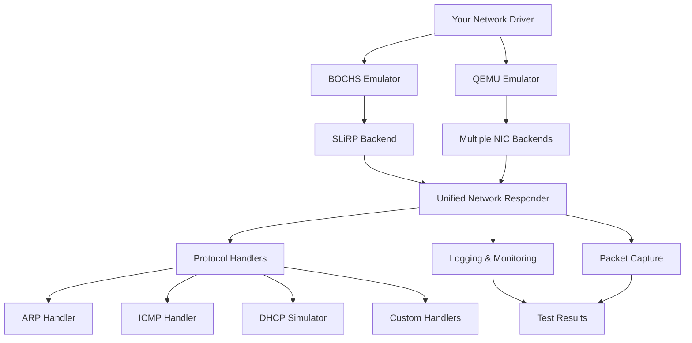

# Network Driver Test Environment 

[](https://www.python.org/)
[](LICENSE)
[](https://bochs.sourceforge.io/)
[]()

A comprehensive network listener/responder system for testing network device drivers with BOCHS and QEMU emulators. Perfect for OS development, driver testing, and network protocol experimentation.

##  Table of Contents

- [Overview](#overview)
- [Features](#-features)
- [Architecture](#-architecture)
- [Quick Start](#-quick-start)
- [Installation](#-installation)
- [Usage](#-usage)
- [Testing Workflow](#-testing-workflow)
- [API Reference](#-api-reference)
- [Examples](#-examples)
- [Troubleshooting](#-troubleshooting)
- [Contributing](#-contributing)
- [License](#-license)

## Overview

The Network Driver Test Environment provides a unified testing platform for network device drivers across multiple emulators. It simulates various network protocols and backends, allowing developers to test drivers in a controlled environment before deploying to real hardware.


##  Features

| Feature | Description | Status |
|---------|-------------|--------|
| **Multi-Emulator Support** | Works with BOCHS and QEMU simultaneously | 
| **Multiple Backends** | SLiRP, Socket, User-mode, TAP interfaces | 
| **Protocol Simulation** | ARP, ICMP, DHCP, custom protocols | 
| **Real-time Monitoring** | Live packet capture and analysis | 
| **Automated Testing** | Built-in test suite and examples | 
| **Cross-platform** | Linux, macOS, Windows (WSL) | 

##  Architecture



### Component Breakdown

| Component | Purpose | File |
|-----------|---------|------|
| **Unified Responder** | Main server handling all connections | `unified-responder.py` |
| **Bochs Config** | Pre-configured SLiRP setup | `bochs-slirp.conf` |
| **QEMU Script** | Multi-NIC environment | `qemu-multi-nic.sh` |
| **Test Suite** | Automated testing framework | `driver-test.sh` |
| **Makefile** | Build automation | `Makefile` |

##  Quick Start

### Setup

```bash
# Clone/download the project
git clone https://github.com/yourusername/network-driver-test.git
cd network-driver-test

# Make scripts executable
chmod +x qemu-multi-nic.sh driver-test.sh

# Start the responder
python3 unified-responder.py
```

### Verify Installation

```bash
# Test the responder
make test

# Expected output:
# Testing Bochs SLiRP connection...
#   Sent: TEST_ARP_REQUEST... -> Got: RESPONSE: TEST_ARP_REQUEST...
# Testing QEMU user-mode connection...
#   Sent: PING... -> Got: PONG...
```

##  Installation

### Prerequisites

| Software | Version | Installation |
|----------|---------|--------------|
| **Python** | 3.6+ | `apt install python3` / `brew install python` |
| **BOCHS** | 2.7+ | `apt install bochs` / `brew install bochs` |
| **QEMU** | 5.0+ | `apt install qemu` / `brew install qemu` |
| **Wireshark** | Optional | `apt install wireshark` |

### Step-by-Step Installation

```bash
# 1. Install prerequisites (Ubuntu/Debian)
sudo apt update
sudo apt install python3 bochs qemu-system-x86 build-essential

# 2. Create project directory
mkdir ~/network-driver-test
cd ~/network-driver-test

# 3. Set up virtual environment (optional but recommended)
python3 -m venv venv
source venv/bin/activate
pip install --upgrade pip
```

##  Usage

### Starting the Test Environment

#### Option 1: Complete Test Suite
```bash
# Run the complete test environment
./driver-test.sh

# Or using make
make full-test
```

#### Option 2: Individual Components
```bash
# Start just the responder
python3 unified-responder.py --udp-port 6969 --tcp-port 6969

# In another terminal, test Bochs
make bochs

# In another terminal, test QEMU
make qemu
```

#### Option 3: Development Mode
```bash
# Start with verbose logging
python3 unified-responder.py --verbose 2>&1 | tee debug.log

# Monitor network traffic
sudo tcpdump -i lo port 6969 -X
```

### Configuration Options

| Argument | Default | Description |
|----------|---------|-------------|
| `--udp-port` | 6969 | UDP port for Bochs SLiRP |
| `--tcp-port` | 6969 | TCP port for QEMU user-mode |
| `--gateway` | 10.0.2.2 | Gateway IP address |
| `--verbose` | False | Enable verbose output |
| `--log-file` | responder.log | Log file location |
| `--pcap-dir` | ./captures | Packet capture directory |

### Makefile Commands

```bash
# Show all available commands
make help

# Common workflows
make clean           # Clean all logs and captures
make test-all        # Run all tests
make monitor         # Start monitoring dashboard
make capture         # Start packet capture
make docs           # Generate documentation
```

##  Testing Workflow

### Testing Your Network Driver

#### Step 1: Prepare Your Driver

Ensure your driver is compiled and ready. Your OS should have:

```c
// Example driver configuration
#define NIC_IO_ADDR  0x300
#define NIC_IRQ      9
#define NIC_MAC      {0xDE, 0xAD, 0xBE, 0xEF, 0x00, 0x01}
```

#### Step 2: Configure Networking

**For Bochs/SLiRP:**
```bash
# Network configuration in your OS
IP:      10.0.2.15
Gateway: 10.0.2.2
DNS:     10.0.2.3
Subnet:  255.255.255.0
```

**For QEMU:**
```bash
# Multiple interfaces will be available:
# - eth0: 10.0.2.15 (user-mode)
# - eth1: DHCP from socket backend
# - eth2: 10.0.3.x network
```

#### Step 3: Run Basic Tests

```bash
# In your OS/driver, run these tests:

# 1. Link detection
ifconfig eth0
# Should show: UP, RUNNING, MAC address

# 2. ARP test
arping -I eth0 10.0.2.2
# Should receive ARP replies

# 3. Ping test
ping 10.0.2.2
# Should receive ICMP Echo Replies

# 4. Throughput test
# Use your driver's transmit/receive functions
```

#### Step 4: Advanced Testing

```bash
# Test packet fragmentation
python3 -c "
import socket
s = socket.socket(socket.AF_INET, socket.SOCK_DGRAM)
# Send large packet (should fragment)
large_data = b'X' * 5000
s.sendto(large_data, ('10.0.2.2', 6969))
"

# Test error conditions
python3 -c "
import socket
# Send malformed packet
s = socket.socket(socket.AF_INET, socket.SOCK_DGRAM)
malformed = b'\xff' * 100  # All ones
s.sendto(malformed, ('10.0.2.2', 6969))
"
```

### Example Test Scenarios

| Test Scenario | Command | Expected Result |
|---------------|---------|-----------------|
| **Basic Connectivity** | `make bochs` | Driver initializes, link up |
| **ARP Resolution** | Send ARP request | Receive ARP reply |
| **ICMP Ping** | `ping 10.0.2.2` | 0% packet loss |
| **Multiple Interfaces** | `make qemu` | All NICs detected |
| **Stress Test** | `./stress-test.sh` | No crashes, minimal loss |
| **Error Handling** | Malformed packets | Driver recovers gracefully |

##  API Reference

### UnifiedNetworkResponder Class

```python
class UnifiedNetworkResponder:
    """Main responder class for handling network requests"""
    
    def __init__(self, config: dict = None):
        """
        Initialize the responder.
        
        Args:
            config: Configuration dictionary
                - udp_port: UDP port number (default: 6969)
                - tcp_port: TCP port number (default: 6969)
                - gateway_ip: Gateway IP address (default: 10.0.2.2)
                - verbose: Enable verbose logging (default: False)
        """
    
    def start(self) -> None:
        """Start all responder services"""
    
    def stop(self) -> None:
        """Stop all responder services"""
    
    def add_protocol_handler(self, protocol: str, handler: callable) -> None:
        """Add custom protocol handler"""
    
    def get_statistics(self) -> dict:
        """Get current statistics"""
        # Returns: {'packets_received': X, 'packets_sent': Y, ...}
```

### Protocol Handlers

```python
# Example custom handler
def my_protocol_handler(data: bytes, src_addr: tuple) -> Optional[bytes]:
    """
    Handle custom protocol packets.
    
    Args:
        data: Received packet data
        src_addr: Source address (ip, port)
    
    Returns:
        Response data or None if no response needed
    """
    if data.startswith(b'MYPROTO'):
        return b'ACK'
    return None

# Register handler
responder.add_protocol_handler('MYPROTO', my_protocol_handler)
```

##  Examples

### Example 1: Basic Driver Test

```python
#!/usr/bin/env python3
"""
Basic driver test example
"""

import time
import socket
from unified_responder import UnifiedNetworkResponder

def test_basic_connectivity():
    """Test basic driver connectivity"""
    
    # Start responder
    responder = UnifiedNetworkResponder({
        'udp_port': 6969,
        'tcp_port': 6969,
        'verbose': True
    })
    
    print("Starting responder...")
    responder.start()
    
    # Give it time to initialize
    time.sleep(2)
    
    # Test connection
    test_socket = socket.socket(socket.AF_INET, socket.SOCK_DGRAM)
    
    test_cases = [
        (b'PING', b'PONG'),
        (b'ARP_REQUEST', b'ARP_RESPONSE'),
        (b'DRIVER_INIT', b'READY')
    ]
    
    for test_input, expected in test_cases:
        test_socket.sendto(test_input, ('127.0.0.1', 6969))
        response, _ = test_socket.recvfrom(1024)
        
        if expected in response:
            print(f"✓ Test passed: {test_input}")
        else:
            print(f"✗ Test failed: {test_input}")
    
    test_socket.close()
    responder.stop()

if __name__ == "__main__":
    test_basic_connectivity()
```

### Example 2: Custom Protocol Test

```python
#!/usr/bin/env python3
"""
Custom protocol test for driver validation
"""

import struct

def create_test_frame(dest_mac: str, src_mac: str, 
                      protocol: int, payload: bytes) -> bytes:
    """
    Create Ethernet frame for testing.
    
    Args:
        dest_mac: Destination MAC (format: 'de:ad:be:ef:00:01')
        src_mac: Source MAC
        protocol: Ethernet protocol (0x0800 for IP, etc.)
        payload: Frame payload
    
    Returns:
        Complete Ethernet frame
    """
    # Convert MAC strings to bytes
    def mac_to_bytes(mac_str):
        return bytes.fromhex(mac_str.replace(':', ''))
    
    frame = (
        mac_to_bytes(dest_mac) +
        mac_to_bytes(src_mac) +
        struct.pack('>H', protocol) +
        payload
    )
    
    return frame

# Test frames for common protocols
TEST_FRAMES = {
    'arp_request': create_test_frame(
        'ff:ff:ff:ff:ff:ff',
        '11:22:33:44:55:66',
        0x0806,
        b'\x00\x01\x08\x00\x06\x04\x00\x01' +  # ARP request
        b'\x11\x22\x33\x44\x55\x66' +          # Sender MAC
        b'\x0a\x00\x02\x02' +                  # Sender IP
        b'\x00\x00\x00\x00\x00\x00' +          # Target MAC
        b'\x0a\x00\x02\x0f'                    # Target IP
    ),
    
    'ping_request': create_test_frame(
        '11:22:33:44:55:66',
        'de:ad:be:ef:00:01',
        0x0800,
        # IP header + ICMP echo request
        b'\x45\x00\x00\x54\x00\x00\x40\x00\x40\x01\x00\x00' +
        b'\x0a\x00\x02\x0f\x0a\x00\x02\x02' +
        b'\x08\x00\xf7\xff\x00\x01\x00\x00' +
        b'PING_TEST' * 8
    )
}
```

##  Troubleshooting

### Common Issues

| Problem | Solution |
|---------|----------|
| **"Address already in use"** | `sudo pkill -f "unified-responder"` |
| **Bochs won't start** | Check `.bochsrc` syntax, ensure disk image exists |
| **No network connectivity** | Verify responder is running, check firewall settings |
| **Permission denied** | Run with sudo or fix permissions: `sudo chmod +x *.sh` |
| **Python import errors** | Install dependencies: `pip install -r requirements.txt` |

### Debug Mode

```bash
# Enable full debugging
python3 unified-responder.py --verbose --log-level DEBUG

# Monitor system resources
top -p $(pgrep -f "unified-responder")

# Check network connections
netstat -tulpn | grep 6969
ss -tulpn | grep 6969

# Capture packets for analysis
sudo tcpdump -i lo -w debug.pcap port 6969
```

### Log Analysis

```bash
# View logs in real-time
tail -f responder.log

# Search for errors
grep -i "error\|fail\|exception" responder.log

# Count packets by type
grep "Received" responder.log | awk '{print $4}' | sort | uniq -c
```

##  Contributing

We welcome contributions! Here's how to get started:

### Development Setup

```bash
# 1. Fork and clone
git clone https://github.com/yourusername/network-driver-test.git
cd network-driver-test

# 2. Create virtual environment
python3 -m venv venv
source venv/bin/activate

# 3. Install development dependencies
pip install -r requirements-dev.txt

# 4. Create feature branch
git checkout -b feature/amazing-feature

# 5. Make changes and test
make test-all

# 6. Commit and push
git commit -m "Add amazing feature"
git push origin feature/amazing-feature

# 7. Create Pull Request
```

### Code Style

- Follow PEP 8 for Python code
- Use meaningful variable names
- Add docstrings to all functions
- Include tests for new features
- Update documentation accordingly

### Testing Contributions

```bash
# Run full test suite
make test-all

# Run specific tests
pytest tests/test_responder.py -v

# Check code style
flake8 unified-responder.py

# Type checking (if using type hints)
mypy unified-responder.py
```

##  License

This project is licensed under the MIT License - see the [LICENSE](LICENSE) file for details.

```
MIT License

Copyright (c) 2024 Network Driver Test Environment Contributors

Permission is hereby granted, free of charge, to any person obtaining a copy
of this software and associated documentation files (the "Software"), to deal
in the Software without restriction, including without limitation the rights
to use, copy, modify, merge, publish, distribute, sublicense, and/or sell
copies of the Software, and to permit persons to whom the Software is
furnished to do so, subject to the following conditions:

The above copyright notice and this permission notice shall be included in all
copies or substantial portions of the Software.
```

##  Acknowledgments

- **Bochs Development Team** - For the excellent x86 emulator
- **QEMU Contributors** - For the versatile virtualization platform
- **Python Community** - For the amazing ecosystem
- **All Contributors** - For making this project better

##  Support

| **Email** | js.ramesh1990@gmail.com |

---

<div align="center">


[](https://star-history.com/#yourusername/network-driver-test&Date)

</div>
